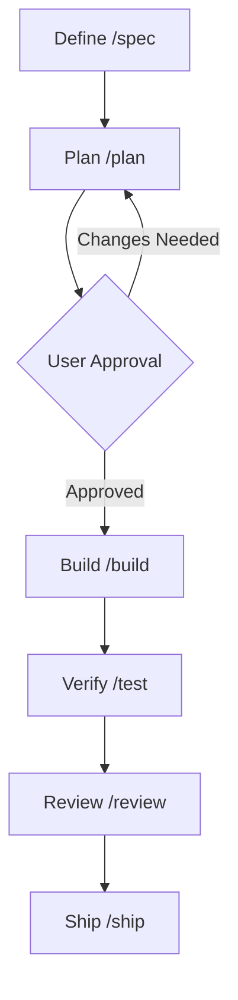

# CLAUDE.md — Agent Constitution & Project Guide

Welcome. This document defines the engineering guidelines, command reference, and workflows for agents (Claude, Cursor, Gemini) operating on this repository.

---

## 🚀 Quick Command Reference

Use these exact commands for common development operations. Do not hallucinate or guess.

### 🧪 Running Tests
- **Python Backend Unit Tests**: `pytest src/api/tests/ -v --tb=short`
- **Node.js Frontend/E2E Tests**: `cd src/tests/e2e && npx playwright test`
- **Frontend Dashboard Tests**: `cd apps/dashboard && npm run test`

### 🧹 Linting & Formatting
- **Python Linting**: `ruff check src/api/`
- **Node.js Linting**: `cd apps/dashboard && npm run lint`

### ⚙️ Running Locally (Development)
- **Entire Stack (Docker)**: `docker compose up -d`
- **FastAPI Backend (Direct)**: `cd src/api && uvicorn src.api.main:app --reload`
- **Next.js Dashboard**: `cd apps/dashboard && npm run dev`
- **Remotion Studio**: `cd apps/remotion-studio && npm run dev`

---

## 🧭 Mandatory Engineering Workflow

You MUST execute all development tasks in the following sequential phases. Do not bypass or consolidate these phases.

1.  **Define (`/spec`)**: Analyze requirements, clarify ambiguities, identify impacted systems, and define constraints.
2.  **Plan (`/plan`)**: Author an `implementation_plan.md` outlining exact files to create/modify, verification plans, and open questions. **You must pause and obtain user approval here.**
3.  **Build (`/build`)**: Write clean, modular code. Write unit tests *before* or *alongside* implementation. Never write production code first and assume tests can wait.
4.  **Verify (`/test`)**: Run unit, integration, and linter suites. Address all errors and warnings before proceeding.
5.  **Review (`/review`)**: Perform a self-review of the diff, verify accessibility guidelines, check input sanitization, and audit console logs.
6.  **Ship (`/ship`)**: Formulate a concise change walkthrough and run final deployment validations.

---

## 🎨 Design & Coding Rules

- **No Placeholders**: Never use `TODO`, `FIXME`, or draft elements in code. Implement completed logic, fallback states, and complete error-handling patterns.
- **Decompose Components**: Avoid monolithic components. If a component exceeds 300 lines or contains independent sub-features, decompose it into smaller files and extract custom hooks.
- **Strict Error Handling**: Never use empty catch blocks. Always log errors properly on the backend or display friendly toasts/UI fallbacks on the frontend.
- **Security Gates**: Sanitise raw user inputs before rendering. Keep all secrets and configurations in environment variables.
- **TypeScript/Type Strictness**: Define proper types and interfaces for all models and payloads. Avoid `any` or lazy casting.
