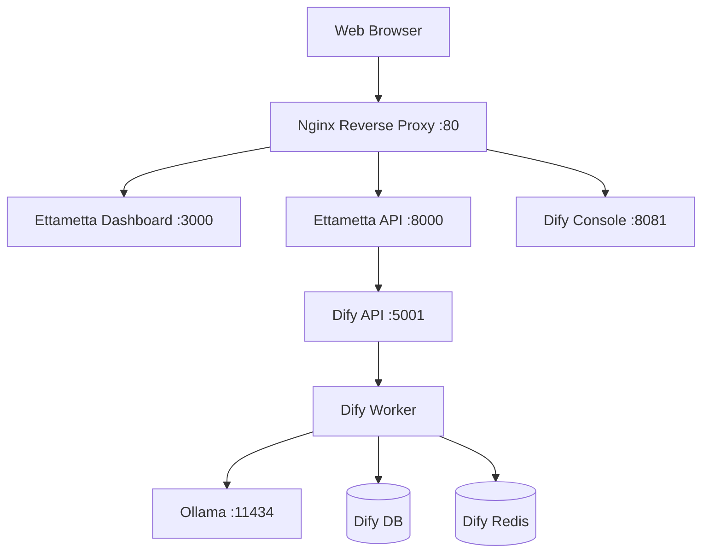

# Ettametta & Dify: Master Integration Guide

This document outlines the production-grade integration between the Ettametta Nexus Engine and the Dify AI Orchestration stack.

## 1. Architecture Overview



## 2. Infrastructure & Deployment

### Docker Stack
Dify is deployed via `docker-compose.dify.yml` and shares the `ettametta_default` network for internal communication.

### Security & Encryption
*   **DIFY_INNER_SECRET_KEY**: This is used for database encryption. It is set to `ettametta_dify_stable_v1_secure` in `.env`. 
    *   *Warning*: Never change this key after the database is initialized, or you will get `PrivkeyNotFoundError`.
*   **CORS**: Managed by Nginx. Dify is configured to allow credentials and dynamic origins from the Ettametta ecosystem.

### Networking
*   **Internal API URL**: `http://ettametta-dify-api:5001/v1`
*   **Public Console URL**: `http://[SERVER_IP]:8081`

---

## 3. Nexus Engine Integration

### Intelligence Hub Routing
The `IntelligenceHub` (`src/services/llm/intelligence_hub.py`) acts as the traffic controller.
*   **Complexity "High"**: Requests are routed to Dify if OpenAI is unavailable or rate-limited.
*   **Timeout**: Set to **300 seconds (5 minutes)** to accommodate slow local model inference on 8GB RAM servers.

### Dify Client
The `DifyClient` (`src/services/llm/dify_client.py`) handles the low-level HTTP communication using the `DIFY_API_KEY`.

### Configuration (.env)
```bash
DIFY_API_URL=http://ettametta-dify-api:5001/v1
DIFY_API_KEY=app-XXXXX  # The App API Key from Dify Console
DIFY_TIMEOUT=300
```

---

## 4. Dify App Configuration (The "Brain")

To keep Nexus running smoothly, follow these rules when creating apps in Dify:

### App Types
1.  **Chatbot (Current Default)**: Best for open reasoning.
2.  **Workflow (Recommended for Production)**: Best for strict data extraction.

### System Prompt (Instructions)
The Nexus Engine expects **Raw JSON**. You must add these exact instructions to your Dify App:
> Always respond in RAW JSON format only. 
> Do NOT include any conversational text, pleasantries, or markdown code blocks (no \`\`\`json).
> 
> Required Format:
> [
>   {"text": "narration", "visual_prompt": "visuals", "mood": "vibe"}
> ]

### Model Provider Setup
1.  Go to **Settings > Model Provider**.
2.  **Ollama**: Set URL to `http://ettametta-ollama:11434`.
3.  **Local Model Advice**: Use `llama3.2:3b` for speed on 8GB servers. Avoid loading multiple large models simultaneously.

---

## 5. Troubleshooting & Maintenance

### Clearing Memory
If Nexus hangs, it's usually because Ollama has too many models loaded.
**Command**: `docker restart ettametta-ollama`

### Encryption Errors (500 Internal Server Error)
If you see `PrivkeyNotFoundError` in `ettametta-dify-worker` logs:
1.  Verify `DIFY_INNER_SECRET_KEY` matches what was used during DB init.
2.  If lost, you must reset the DB: 
    *   `docker exec -it ettametta-db-1 psql -U dify -d dify`
    *   `DROP SCHEMA public CASCADE; CREATE SCHEMA public;`
    *   Restart Dify stack to re-run migrations.

### Logs
*   **Dify API**: `docker logs ettametta-dify-api`
*   **Dify Worker**: `docker logs ettametta-dify-worker`
*   **Ollama**: `docker logs ettametta-ollama`
