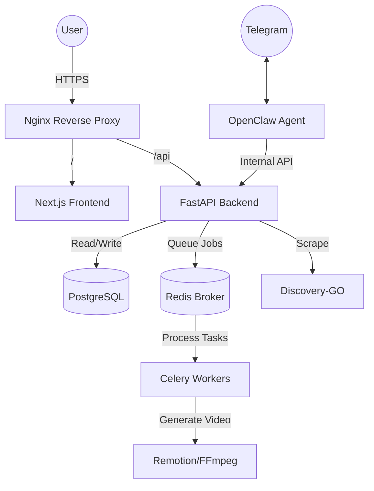

# Ettametta Architecture Review

## 1. System Overview
Ettametta is a distributed AI-powered video generation and content discovery platform. It utilizes a microservices architecture coordinated via Docker Compose.

## 2. Networking & Middleware
### Reverse Proxy (Nginx)
- **Role**: Entry point, SSL termination (planned), and request routing.
- **Routing**:
    - `/` -> Dashboard container (Port 3000)
    - `/api/` -> API container (Port 8000)
    - `/api/ws/` -> WebSocket support for real-time updates.
- **Security**: Implements HSTS, X-Frame-Options, and a strict CSP.

### API Middleware (FastAPI)
- **CORS**: Correctly configured to allowed designated frontend origins.
- **Security Sentinel**: Custom middleware for rate limiting and brute-force protection.
- **Gzip**: Compression enabled for faster response times.

## 3. Core Use Cases Validation

### Use Case 1: Video Generation Flow
1. **User Request**: Initiated via Dashboard or Telegram.
2. **API Handshake**: Validates JWT/Internal Token.
3. **Task Queue**: API pushes a `render_video` task to Redis.
4. **Worker Processing**: Celery worker picks up the task, uses FFmpeg/Remotion.
5. **Real-time Update**: Worker status synced via WebSocket to Dashboard.

### Use Case 2: Content Discovery
1. **Trigger**: Scheduled or manual request.
2. **Scraper**: Discovery-GO (Golang) performs high-concurrency scraping.
3. **Database**: Results stored in PostgreSQL `ContentCandidateDB`.
4. **Visualization**: API serves candidates to Dashboard.

## 4. Current Optimizations
- **Resource Management**: Switched to CPU-only ML to save 5GB+ RAM.
- **Persistence**: Fixed Nginx mount conflicts using volume sharing.
- **Security**: Restored `INTERNAL_API_TOKEN` for service-to-service auth.
